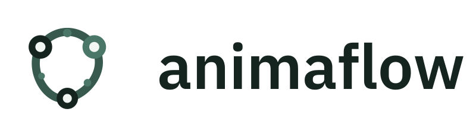
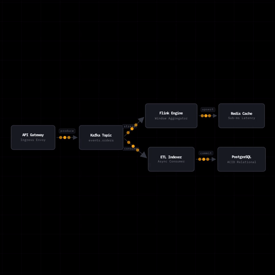
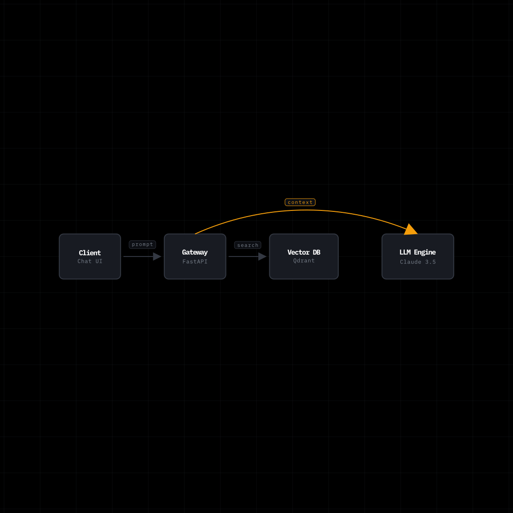

<p align="center">
  <picture>
    <source media="(prefers-color-scheme: dark)" srcset="./brand/png/logo-horizontal-800.png">
    
  </picture>
</p>

<p align="center">
  <strong>Diagramas e fluxogramas de arquitetura declarativos, animados e programáveis em Python</strong><br>
  <sub>Projete fluxos técnicos modernos uma única vez e renderize para Manim (MP4, GIF), Web Canvas/SVG interativo ou Remotion</sub>
</p>

<p align="center">
  <a href="https://pypi.org/project/animaflow/"></a>
  <a href="https://opensource.org/licenses/MIT"></a>
  <a href="https://github.com/Oseiasdfarias/animaflow/actions"></a>
  <a href="https://github.com/Oseiasdfarias/animaflow"></a>
</p>

<p align="center">
  
  
  
  
</p>

<p align="center">
  <a href="#-por-que-o-animaflow">Por que o animaflow?</a> ·
  <a href="#-galeria--exemplos">Galeria & Exemplos</a> ·
  <a href="#-como-funciona-a-arquitetura">Arquitetura</a> ·
  <a href="#-instalação">Instalação</a> ·
  <a href="#-começando-rápido">Começando Rápido</a> ·
  <a href="#-exemplos-prontos">Exemplos Prontos</a> ·
  <a href="#-identidade-visual">Identidade Visual</a> ·
  <a href="#-estrutura-do-repositório">Estrutura</a> ·
  <a href="#-roadmap-e-próximos-passos">Roadmap</a> ·
  <a href="#-autoria--licença">Autoria & Licença</a>
</p>

---

## 📸 Galeria & Exemplos

<table>
  <tr>
    <td width="33%"></td>
    <td width="33%"></td>
    <td width="33%"></td>
  </tr>
  <tr>
    <td align="center"><sub><b>Streaming Contínuo</b> — fluxo em tempo real de partículas</sub></td>
    <td align="center"><sub><b>Multi-Agent Swarm</b> — DAG de orquestração em camadas</sub></td>
    <td align="center"><sub><b>RAG Pipeline</b> — arquitetura de busca e LLM</sub></td>
  </tr>
</table>

---

## 🚀 Por que o animaflow?

Criar diagramas de arquitetura de software para **redes profissionais (LinkedIn, X/Twitter)**, **vídeos técnicos (YouTube, Reels)** e **apresentações corporativas** geralmente exige:
- Escrever centenas de linhas manuais de geometria, coordenadas absolutas e updaters no Manim ou After Effects, **ou**
- Usar geradores estáticos (Graphviz, PlantUML, Diagrams) sem qualquer suporte a movimento, ritmo narrativo ou pulso de dados.

O **animaflow** resolve isso separando a **definição semântica do fluxo** dos **motores de renderização**:
1. **Declare Nós e Conexões**: especifique nós, serviços, banco de dados, labels e metadados via DSL simples em Python.
2. **Auto-Layout Inteligente**: organize automaticamente nós em camadas (DAGs), colunas ou sequências horizontais/verticais com alinhamento e margens dinâmicas anti-sobreposição.
3. **Timeline Narrativa**: anime pacotes individuais, streams contínuos de partículas, transições de estado e realces de nós de forma declarativa.
4. **Múltiplos Backends**: exporte diretamente para **Manim CE** (vídeos MP4 e GIFs em alta definição) e **HTML/Web Canvas interativo**.

---

## 🏛️ Como funciona a arquitetura

O núcleo do **animaflow** é modular e extensível:

| Módulo / Subsistema | O que faz | Tecnologia / Detalhes |
| --- | --- | --- |
| **Flow Core** (`core.flow`) | Armazena a topologia do grafo, metadados dos nós, conectores e parâmetros visuais | Python Puro / Dataclasses |
| **Layout Engine** (`core.layout`) | Algoritmos de arranjo automático (horizontal, vertical, empilhamento em camadas DAG) calculando larguras mínimas e espaçamento | Algoritmos de layout de grafos |
| **Timeline Engine** (`core.timeline`) | Orquestra as ações temporais: sequências de aparição (`reveal`), envio de pacotes (`send_packet`), streams contínuos (`stream_packets`), realces (`highlight_node`) e esperas (`wait`) | Motor declarativo de eventos |
| **Manim Backend** (`backends.manim`) | Converte nós e conexões em Mobjects vetoriais modernos com tipografia refinada, sombras sutis, badges de subtítulo e renderiza a cena | Manim Community Edition (CE) |
| **Web Canvas Backend** (`backends.web`) | Gera código HTML/SVG independente e interativo com simulação física de partículas em JavaScript puro | SVG nativo + ES6 Vanilla JS |

---

## 📦 Instalação

```bash
# Instalação básica (Core + Web Canvas export)
pip install animaflow

# Com suporte completo ao renderizador de vídeo Manim (MP4 / GIF)
pip install "animaflow[manim]"

# Instalação completa de desenvolvimento
pip install "animaflow[all]"
```

> **Nota:** Para renderização via Manim, é necessário ter o `ffmpeg` instalado no seu sistema operacional.

---

## ⚡ Começando Rápido

### 1. Criando um fluxo com animação contínua (Stream de Partículas)

```python
from manim import Scene
import animaflow as af

class MyArchitectureScene(Scene):
    def construct(self):
        # 1. Cria o fluxo de arquitetura
        flow = af.Flow(title="Real-Time Event Processing")

        # 2. Declara os nós do sistema
        client = flow.add_node("Mobile / IoT", subtitle="MQTT Producer")
        broker = flow.add_node("Event Bus", subtitle="Kafka Cluster")
        worker = flow.add_node("Stream Worker", subtitle="Flink / Python")
        store  = flow.add_node("Data Lake", subtitle="ClickHouse")

        # 3. Organiza o layout em camadas automáticas
        flow.auto_layout_layers([[client], [broker], [worker], [store]], h_gap=1.6, v_gap=0.8)

        # 4. Conecta os componentes
        flow.connect(client, broker, label="telemetry")
        flow.connect(broker, worker, label="ingest")
        flow.connect(worker, store, label="batch write")

        # 5. Programa a narrativa de animação
        flow.timeline.reveal_sequence(delay=0.3)
        flow.timeline.stream_packets(count=6, speed=0.8, duration=3.0)
        flow.timeline.wait(1.0)

        # 6. Renderiza na cena Manim
        flow.render_manim(self)
```

### 2. Exportando para Web Interativa (HTML/SVG)

```python
# Exportação simples para arquivo HTML estático
html_content = flow.export_html()

with open("arquitetura.html", "w", encoding="utf-8") as f:
    f.write(html_content)
```

---

## 📂 Exemplos Prontos

O repositório inclui exemplos completos na pasta [`examples/`](./examples/):

| Exemplo | Descrição | Como Executar |
| --- | --- | --- |
| [`event_driven_pipeline.py`](./examples/event_driven_pipeline.py) | Pipeline de eventos em tempo real com stream contínuo de partículas e layout em camadas | `manim -qm examples/event_driven_pipeline.py EventDrivenPipelineAnimation` |
| [`multi_agent_swarm.py`](./examples/multi_agent_swarm.py) | DAG de orquestração multi-agente com nós em cascata e nós paralelos | `manim -qm examples/multi_agent_swarm.py AgentSwarmAnimation` |
| [`rag_pipeline_manim.py`](./examples/rag_pipeline_manim.py) | Arquitetura completa de RAG (Retrieval-Augmented Generation) | `manim -qm examples/rag_pipeline_manim.py RAGFlowAnimation` |
| [`rag_pipeline_web.py`](./examples/rag_pipeline_web.py) | Demonstração da exportação para visualizador HTML interativo | `python examples/rag_pipeline_web.py` |

---

## 🎨 Identidade Visual (Nordic Sage & Carbon)

A identidade visual do **animaflow** foi concebida com princípios de design editorial nórdico e precisão industrial, evitando gradientes genéricos e priorizando contraste técnico:

<p align="center">
  
</p>

- **Símbolo**: Três nós de arquitetura dispostos em triangulação fechada por um circuito orbital contínuo de dados.
- **Tipografia**: **IBM Plex Sans SemiBold** com curvas vetoriais extraídas via `fontTools` (sem dependência de fontes externas instaladas).
- **Pacote Completo**: Disponível no diretório [`brand/`](./brand/) com versões em SVG puro, PNGs rasterizados via PyCairo (16px a 1600px), favicons e guia de uso em [`brand/README.md`](./brand/README.md).

---

## 📁 Estrutura do Repositório

```
animaflow/
├── brand/                      # Identidade visual oficial (Nordic Sage & Carbon)
│   ├── README.md               # Especificação de design, paleta e regras de aplicação
│   ├── scripts/                # Scripts autônomos de geração (PyCairo + fontTools)
│   ├── svg/                    # SVGs de alta precisão com tipografia em curvas
│   └── png/                    # PNGs rasterizados em alta resolução (16px a 1600px)
├── docs/                       # Documentação técnica de implementação e assets
│   ├── IMPLEMENTATION_OVERVIEW.md  # Status detalhado das implementações e roadmap
│   └── assets/                 # Demonstrações, capturas e GIFs do pipeline
├── src/
│   └── animaflow/
│       ├── core/               # Modelos (Flow, Node, Edge, Layout, Timeline)
│       │   ├── flow.py
│       │   ├── layout.py
│       │   └── timeline.py
│       └── backends/           # Renderizadores plugáveis
│           ├── manim/          # Integração Manim CE (Mobjects vetoriais e animações)
│           └── web/            # Gerador de Canvas SVG interativo
├── examples/                   # Scripts de demonstração prontos para rodar
├── tests/                      # Bateria de testes unitários e de integração
├── pyproject.toml              # Metadados de empacotamento e dependências
└── README.md                   # Documentação principal
```

---

## 🗺️ Roadmap e Próximos Passos

Para uma visão detalhada do que já foi construído e das próximas entregas, consulte o documento [docs/IMPLEMENTATION_OVERVIEW.md](./docs/IMPLEMENTATION_OVERVIEW.md).

- [x] DSL semântica de fluxos em Python
- [x] Motor de auto-layout em camadas (DAGs) com margens dinâmicas anti-sobreposição
- [x] Renderizador vetorial Manim com suporte a temas e subtítulos
- [x] Animação de pacotes discretos e **stream contínuo de partículas**
- [x] Exportador para Web Canvas SVG interativo
- [x] Identidade visual oficial **Nordic Sage & Carbon** (SVGs, PNGs, Favicons, Banner)
- [ ] Controles interativos no Web Canvas (Play/Pause, Zoom e Pan)
- [ ] Suporte nativo a **Diagramas de Sequência** (`SequenceDiagram`)
- [ ] API de estilização avançada (formas de nós customizadas, estilos de setas e gradientes)
- [ ] CLI dedicada (`animaflow render <script> --backend manim|web`)
- [ ] Exportação direta para formatos adicionais (JSON para Remotion, GraphViz DOT)

---

## 👨‍💻 Autoria & Licença

Desenvolvido por **[Oséias Farias](https://github.com/Oseiasdfarias)**.

Distribuído sob a licença **MIT**. Consulte [`LICENSE`](./LICENSE) para mais detalhes.
