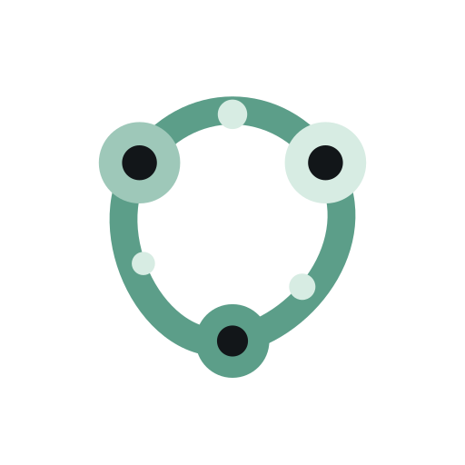
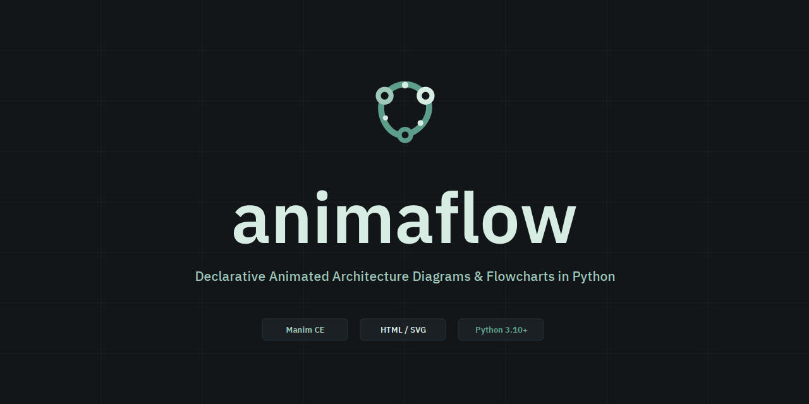

# Guia da Marca & Identidade Visual

A identidade do **animaflow** foi concebida sob os princípios do design escandinavo e da escola suíça de tipografia, priorizando elegância técnica e sobriedade analítica com a paleta oficial **Nordic Sage & Carbon**.

---

## 🏔️ A Filosofia do Símbolo

  

1. **Os Três Nós Primários**: Representam a topologia elementar de todo fluxo técnico — *Origem / Produtor*, *Processamento / Roteamento* e *Destino / Consumidor*.
2. **O Circuito Contínuo**: A órbita fechada expressa a natureza ininterrupta dos fluxos de dados modernos e a integração contínua.
3. **Harmonia Mineral**: Em vez de cores estridentes ou gradientes genéricos de IA, adotamos tons derivados de minerais e vegetação nórdica.

---

## 🎨 A Paleta Oficial: Nordic Sage & Carbon

  

| Papel | Nome | Hex | Amostra |
| --- | --- | --- | :---: |
| **Dark Background** | Carvão Mineral | `#121619` |  |
| **Dark Surface** | Ardósia Profunda | `#1A2024` |  |
| **Sage Light** | Sálvia Mineral | `#9EC8B9` |  |
| **Sage Ice** | Sálvia Gélido | `#D7EBE3` |  |
| **Jade Conductor** | Jade Técnico | `#5C9E89` |  |
| **Light Background** | Papel Nórdico | `#F2F6F4` |  |
| **Light Ink** | Tinta Grafite | `#162420` |  |

---

## 📐 Tipografia: IBM Plex Sans

O logotipo utiliza a fonte **IBM Plex Sans SemiBold**, convertida matematicamente em curvas vetoriais (`fontTools`), garantindo consistência universal em qualquer sistema operacional ou dispositivo.

