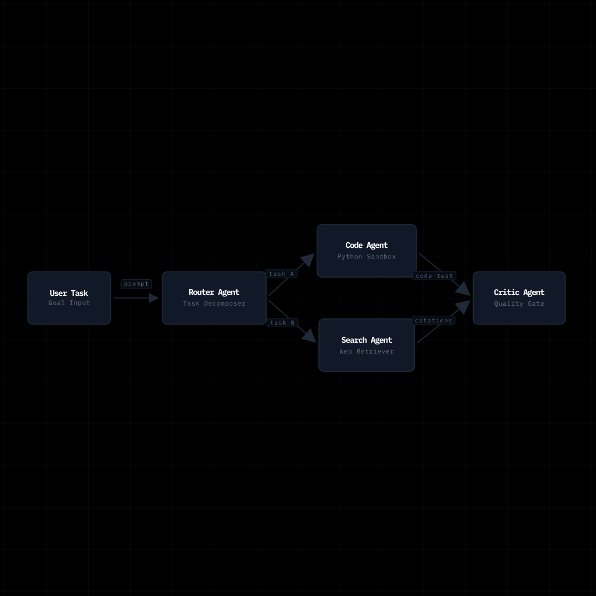

# Galeria: Orquestração Swarm Multi-Agente

Este caso de uso demonstra uma rede de múltiplos agentes inteligentes de IA organizados em camadas paralelas com dependências direcionadas.

---

## 📸 Demonstração Visual

<p align="center">
  
</p>

---

## 💻 Código Completo

Disponível em [`examples/multi_agent_swarm.py`](https://github.com/Oseiasdfarias/animaflow/blob/main/examples/multi_agent_swarm.py):

```python
from manim import Scene
import animaflow as af

class AgentSwarmAnimation(Scene):
    def construct(self):
        flow = af.Flow(title="Multi-Agent Orchestration Swarm")

        # 1. Agente Central e Agentes Especialistas
        planner = flow.add_node("Planner Agent", subtitle="Orchestrator")
        researcher = flow.add_node("Researcher", subtitle="Search & RAG")
        coder = flow.add_node("Coder Agent", subtitle="Code & Tests")
        critic = flow.add_node("Critic Agent", subtitle="Linter & Eval")
        deployer = flow.add_node("Deployer", subtitle="CI/CD Runner")

        # 2. Layout em camadas com múltiplos nós por estágio
        flow.auto_layout_layers(
            layers=[
                [planner],
                [researcher, coder, critic],  # Camada intermediária paralela
                [deployer]
            ],
            h_gap=1.8,
            v_gap=0.9
        )

        # 3. Roteamento de tarefas
        flow.connect(planner, researcher, label="task")
        flow.connect(planner, coder, label="task")
        flow.connect(coder, critic, label="review")
        flow.connect(critic, deployer, label="approved")

        # 4. Sequência de animação
        flow.timeline.reveal_sequence(delay=0.2)
        flow.timeline.stream_packets(count=5, speed=0.7, duration=3.0)
        flow.timeline.wait(1.0)

        # 5. Renderização
        flow.render_manim(self)
```

---

## 🚀 Como Executar

```bash
manim -qm examples/multi_agent_swarm.py AgentSwarmAnimation
```

