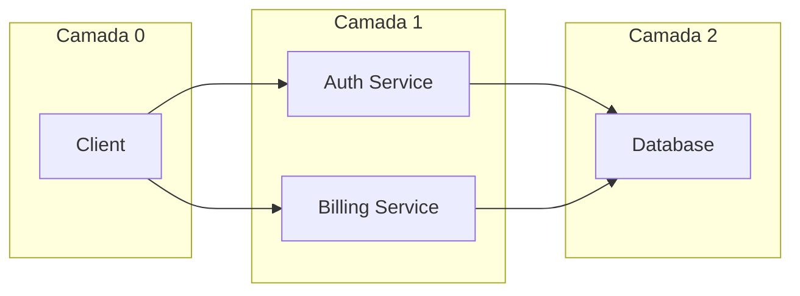

# Layout em Camadas (DAGs)

Um dos recursos mais poderosos do **animaflow** é o layout em camadas (`auto_layout_layers`), projetado para posicionar grafos acíclicos direcionados (DAGs) complexos sem sobreposição de caixas.

---

## :material-ruler-square: Como Funciona o Algoritmo

O método `flow.auto_layout_layers()` organiza o diagrama em colunas de estágios lógicos:



1. **Cálculo da Largura Máxima por Coluna**: Cada nó tem sua largura estimada com base no comprimento dos textos `name` e `subtitle`. O algoritmo encontra a maior largura de cada coluna.
2. **Distribuição Horizontal com Gap Fixo (`h_gap`)**: O centro $X$ de cada coluna é posicionado mantendo o espaçamento livre especificado entre a borda direita de uma coluna e a borda esquerda da seguinte.
3. **Alinhamento e Centralização Vertical (`v_gap`)**: Dentro de cada coluna, os nós são empilhados verticalmente e o bloco inteiro é centralizado verticalmente no eixo $Y=0$.

---

## :material-code-tags: Exemplo de Uso

```python
# Definindo as camadas como listas de nós
layer_0 = [user_client]
layer_1 = [api_gateway]
layer_2 = [auth_worker, order_worker, email_worker]  # 3 nós em paralelo
layer_3 = [database_cluster]

# Executa o auto-layout
flow.auto_layout_layers(
    layers=[layer_0, layer_1, layer_2, layer_3],
    h_gap=1.8,  # Espaço horizontal entre as bordas das colunas
    v_gap=0.9   # Espaço vertical entre os nós paralelos
)
```

---

## :material-tune-variant: Parâmetros do `auto_layout_layers``auto_layout_layers`

| Parâmetro | Tipo | Padrão | Descrição |
| --- | --- | --- | --- |
| `layers` | `List[List[Node]]` | *obrigatório* | Lista de colunas, onde cada coluna contém um ou mais nós |
| `h_gap` | `float` | `1.5` | Distância mínima horizontal entre a borda mais externa de uma coluna e a próxima |
| `v_gap` | `float` | `0.8` | Distância mínima vertical entre nós adjacentes na mesma coluna |

