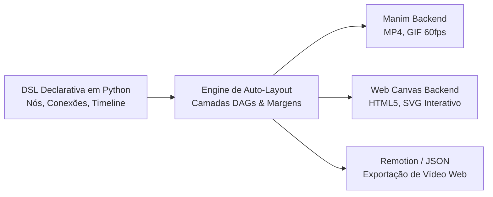

<div class="hero-container">
  <span class="hero-tag">Design Declarativo · Python · Animação</span>
  <h1 class="hero-title">animaflow (animaflow.io)</h1>
  <p class="hero-subtitle">
    Crie diagramas e fluxogramas de arquitetura modernos uma única vez em Python e renderize animações fluidas para vídeos técnicos (Manim) ou web interativa (HTML/SVG).
  </p>
  <div class="hero-buttons">
    <a href="getting-started/quickstart/" class="btn-primary">Comece em 5 Minutos →</a>
    <a href="getting-started/installation/" class="btn-secondary">Guia de Instalação</a>
  </div>
</div>

## :material-view-carousel: Demonstração em Tempo Real

Veja abaixo exemplos de diagramas construídos declarativamente e renderizados em vídeo e SVG interativo:

| Streaming Contínuo de Partículas | Orquestração Multi-Agente (DAGs) | Pipeline de Busca & RAG |
| :---: | :---: | :---: |
|  |  |  |
| **Pipeline de Eventos**<br><sub>Fluxo de dados em tempo real</sub> | **Orquestração Paralela**<br><sub>Camadas automáticas de nós</sub> | **Arquitetura de IA**<br><sub>Busca vetorial e geração</sub> |

---

## :material-lightning-bolt: Por que usar o animaflow?

Desenvolver animações de arquitetura de software para **LinkedIn, YouTube, talks técnicas e documentação corporativa** historicamente exigia uma escolha dolorosa:

1. **Escrever centenas de linhas de geometria manual** em After Effects ou Manim com coordenadas absolutas frágeis a qualquer refatoração; **ou**
2. **Usar ferramentas estáticas** (Graphviz, PlantUML, Diagrams) que não contam história, não pulsam e não representam o fluxo de dados em movimento.

O **animaflow** introduz uma separação clara entre **semântica de dados** e **renderizadores**:



---

## :material-play-circle-outline: Exemplo Rápido: Declarando um Pipeline com Stream

```python
from manim import Scene
import animaflow as af

class EventFlowScene(Scene):
    def construct(self):
        # 1. Criação do fluxo com título
        flow = af.Flow(title="Event-Driven Microservices")

        # 2. Definição semântica dos componentes
        client = flow.add_node("IoT Devices", subtitle="MQTT")
        broker = flow.add_node("Kafka Broker", subtitle="Event Bus")
        worker = flow.add_node("Stream Worker", subtitle="Flink / Python")
        lake   = flow.add_node("Data Lake", subtitle="ClickHouse")

        # 3. Posicionamento automático em camadas
        flow.auto_layout_layers([[client], [broker], [worker], [lake]], h_gap=1.6)

        # 4. Conexão lógica com rótulos
        flow.connect(client, broker, label="telemetry")
        flow.connect(broker, worker, label="ingest")
        flow.connect(worker, lake, label="write")

        # 5. Narrativa de animação declarativa
        flow.timeline.reveal_sequence(delay=0.3)
        flow.timeline.stream_packets(count=6, speed=0.8, duration=3.0)
        flow.timeline.wait(1.0)

        # 6. Renderização na cena Manim
        flow.render_manim(self)
```

---

## :material-compass-outline: Navegação Rápida

<div class="grid cards" markdown>

-   :material-clock-fast:{ .lg .middle } __Primeiros Passos__

    ---

    Aprenda como instalar e criar seu primeiro fluxo em minutos.

    [:octicons-arrow-right-24: Começando](getting-started/installation.md)

-   :material-layers-triple:{ .lg .middle } __Auto-Layout em Camadas__

    ---

    Descubra como o algoritmo organiza DAGs e calcula margens anti-sobreposição.

    [:octicons-arrow-right-24: Guia de Layout](guides/auto-layout.md)

-   :material-movie-play:{ .lg .middle } __Animações e Streams__

    ---

    Sequências de entrada, pacotes pontuais e fluxo contínuo de partículas.

    [:octicons-arrow-right-24: Guia de Animações](guides/continuous-stream.md)

-   :material-code-json:{ .lg .middle } __Referência de API__

    ---

    Documentação detalhada de classes, métodos e parâmetros tipados.

    [:octicons-arrow-right-24: API Reference](api/flow.md)

</div>

